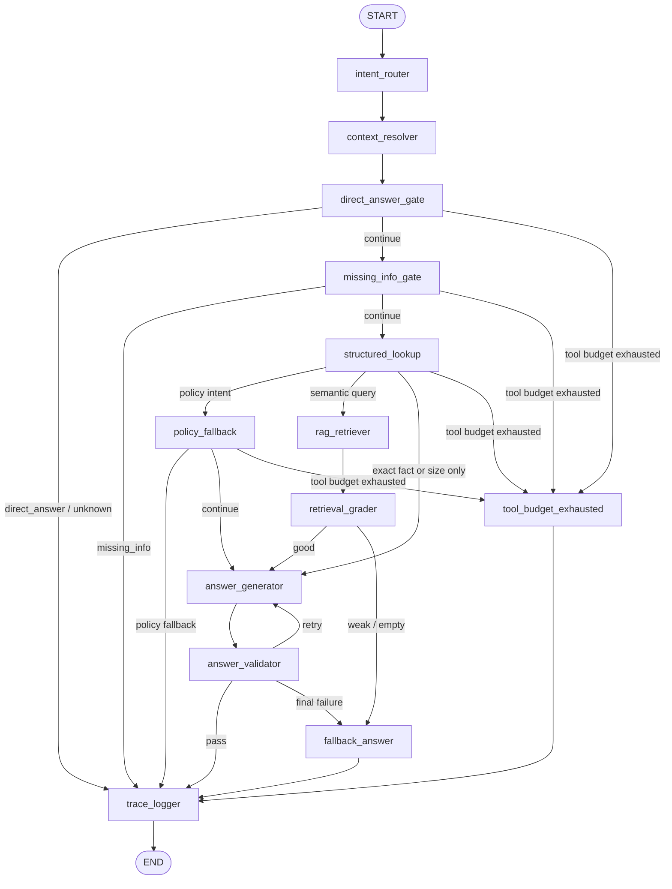

# LangGraph 工作流设计

本文档说明当前 LangGraph 主线的节点设计、状态流转、分支条件和数据边界。
它是开发和 review LangGraph 代码时的设计契约。

## 1. 目标

当前项目的目标不是“为了使用 LangGraph 而使用 LangGraph”，而是把服装导购 Agent 的业务行为拆成可测试、可追踪、可扩展的生产节点：

```text
用户问题
-> 意图识别
-> 历史上下文解析
-> 直接回答或缺信息追问
-> 结构化查询或 RAG 检索
-> 证据过滤
-> 草稿生成
-> 确定性校验
-> trace/debug 输出
-> 最终回答
```

主入口：

```text
clothing_assistant.agent.langgraph_executor.run_langgraph_agent
```

图构造文件：

```text
clothing_assistant/agent/langgraph_executor.py
```

节点实现文件：

```text
clothing_assistant/agent/nodes.py
```

状态定义文件：

```text
clothing_assistant/agent/state.py
```

## 2. 当前图结构

当前主线图：

```text
START
-> intent_router
-> context_resolver
-> direct_answer_gate
-> missing_info_gate
-> structured_lookup
-> policy_fallback
-> rag_retriever
-> retrieval_grader
-> answer_generator 或 fallback_answer
-> answer_validator
-> trace_logger
-> END
```

真实路由包含条件分支，不是每个请求都会经过所有业务节点。



## 3. AgentState 状态契约

`AgentState` 是 LangGraph 中每个节点共享的状态容器。节点应该只返回自己负责更新的字段。

核心输入字段：

| 字段 | 类型 | 用途 |
| --- | --- | --- |
| `user_query` | 字符串 | 用户当前问题 |
| `chat_history` | 列表 | 显式传入的历史对话 |
| `thread_id` | 字符串 | LangGraph checkpoint/debug 会话 id |
| `run_id` | 字符串 | 单次请求 id |

核心中间字段：

| 字段 | 生产节点 | 用途 |
| --- | --- | --- |
| `intent_result` | `intent_router` | 意图、query_type、是否需要历史 |
| `memory_result` | `context_resolver` | 使用了哪些历史、为什么忽略历史 |
| `agent_query` | `context_resolver` | 工具实际使用的查询文本 |
| `missing_info_result` | `missing_info_gate` | 缺哪些关键字段，是否可继续 |
| `structured_result` | `structured_lookup` | 商品、库存、价格、尺码规则等精确事实 |
| `accepted_chunks` | `retrieval_grader` | 被接受的 RAG 证据 |
| `rejected_chunks` | `retrieval_grader` | 被拒绝的弱证据 |
| `retrieval_route` | `retrieval_grader` | 检索质量路由：`good`、`weak`、`empty` 或 `skipped` |
| `draft_answer` | `answer_generator` | 草稿答案 |
| `validation_result` | `answer_validator` | 最终答案是否有证据 |
| `generation_attempts` | `answer_generator` | 当前回答生成已尝试次数 |
| `max_generation_attempts` | 初始状态 | 回答生成最大尝试次数 |
| `validation_feedback` | `answer_validator` | 失败后给下一次生成使用的校验反馈 |
| `fallback_result` | `fallback_answer` | 兜底类型和原因 |
| `evidence_summary` | `trace_logger` | 本次运行的证据摘要 |

工具和输出字段：

| 字段 | 用途 |
| --- | --- |
| `selected_tools` | 本次选择的工具名称列表 |
| `tool_call_count` | 工具调用次数，用于预算保护 |
| `tool_results` | 各工具原始结果 |
| `answer` | 用户可见最终答案 |
| `final_prompt` | debug/eval 使用的最终 prompt 或说明 |
| `stop_reason` | 停止原因 |
| `trace_events` | 节点 trace，使用 reducer 追加 |

`trace_events` 使用 `Annotated[list, operator.add]`。这意味着节点返回：

```python
{"trace_events": [new_event]}
```

LangGraph 会把新事件追加到旧列表后面，而不是覆盖旧 trace。

## 4. 节点契约

### 4.1 `intent_router`

实现函数：

```text
route_intent_node
```

目的：

识别用户问题属于哪类意图。

写入字段：

```text
intent_result
trace_events
```

典型 `intent_result`：

```json
{
  "intent": "inventory_check",
  "query_type": "inventory",
  "need_history": false,
  "reason": "命中库存、颜色是否有货相关关键词。"
}
```

说明：

- 当前是规则路由，不是 LLM router。
- 规则路由稳定、可测，适合当前阶段。
- 后续如果升级为 LLM router，需要保留相同输出 schema。

### 4.2 `context_resolver`

实现函数：

```text
resolve_memory_node
```

目的：

判断当前问题是否需要历史上下文，并生成工具使用的 `agent_query`。

写入字段：

```text
memory_result
agent_query
trace_events
```

当前行为：

- `chat_history` 仍由 API 调用方显式传入。
- `thread_id` 当前主要用于 checkpoint/debug。
- 会话消息还没有完全迁移到 LangGraph state reducer。

生产演进方向：

- 后续可以让 `thread_id` 绑定短期 memory。
- 本地 `InMemorySaver` 可替换成 Postgres checkpointer。

### 4.3 `direct_answer_gate`

实现函数：

```text
direct_answer_node
```

目的：

对闲聊、未知问题直接回答，避免进入工具链。

停止时写入字段：

```text
answer
final_prompt
stop_reason
trace_events
```

停止示例：

| Intent | stop_reason | Behavior |
| --- | --- | --- |
| `chat` | `direct_answer` | 直接介绍助手能力 |
| `unknown` | `direct_answer` | 引导用户补充咨询范围 |

### 4.4 `missing_info_gate`

实现函数：

```text
missing_info_gate_node
```

目的：

在调用工具之前检查关键字段是否齐全。

写入字段：

```text
missing_info_result
answer
final_prompt
stop_reason
trace_events
```

业务规则：

| Intent | Required fields |
| --- | --- |
| `inventory_check` | product, color, size |
| `price_check` | product |
| `size_recommendation` | height and weight |

Examples:

```text
黑色M码有货吗？
```

缺失字段：

```json
{
  "missing_fields": ["product"],
  "can_continue": false
}
```

停止原因：

```text
stop_reason = "missing_info"
```

为什么需要这个节点：

生产 Agent 不能靠 prompt 猜商品、颜色、尺码。缺字段时应该追问。

### 4.5 `structured_lookup`

实现函数：

```text
structured_lookup_node
```

目的：

执行精确事实查询或确定性业务工具。

写入字段：

```text
structured_result
selected_tools
tool_call_count
tool_results
trace_events
```

结构化事实来源：

```text
clothing_assistant/data/product_catalog.json
```

这里处理的精确事实：

- SKU / product_id
- 商品名
- 商品类别
- 材质字段
- 颜色列表
- 库存
- 价格
- size_rule_id
- policy_id

关键边界：

库存和价格必须来自结构化数据，不能来自 RAG，也不能由 LLM 编造。

示例：

```text
基础款纯棉T恤黑色L码有货吗？
```

预期工具：

```json
["structured_lookup"]
```

预期结构化结果：

```json
{
  "lookup_type": "inventory",
  "matched_product_id": "TSHIRT_BASIC_001",
  "color": "黑色",
  "size": "L",
  "stock_count": 8,
  "in_stock": true
}
```

### 4.6 `policy_fallback`

实现函数：

```text
policy_fallback_node
```

目的：

政策类问题如果没有政策来源，直接兜底，不让大模型编造退换货、物流或售后规则。

停止时写入字段：

```text
answer
final_prompt
stop_reason
trace_events
```

停止原因：

```text
stop_reason = "policy_fallback"
```

### 4.7 `rag_retriever`

实现函数：

```text
rag_retriever_node
```

目的：

只处理解释性知识检索。

RAG 负责：

- 颜色搭配建议
- 洗涤养护解释
- 风格和场景推荐
- 季节适配
- 材质解释

RAG 不负责：

- 库存
- 价格
- SKU 精确匹配
- 可购买尺码库存

写入字段：

```text
selected_tools
tool_call_count
tool_results["rag_tool"]
trace_events
```

### 4.8 `retrieval_grader`

实现函数：

```text
retrieval_grader_node
```

目的：

过滤弱证据，避免没有足够资料时硬答。

当前版本：

- 规则版 grader。
- 不使用 LLM judge。
- 根据 `query_type`、来源文件和 score 过滤。

写入字段：

```text
accepted_chunks
rejected_chunks
retrieval_route
tool_results["rag_tool"].retrieved_chunks
trace_events
```

当前来源规则：

| query_type | Preferred files |
| --- | --- |
| `recommendation` | `颜色选择.txt`, `洗涤养护.txt`, `尺码推荐.txt` |
| `product` | `颜色选择.txt`, `洗涤养护.txt`, `尺码推荐.txt` |
| `size` | `尺码推荐.txt`, `颜色选择.txt` |

为什么先用规则评分：

生产级不是所有判断都交给 LLM。确定性规则更容易测试，也更容易解释失败原因。

路由结果：

| `retrieval_route.status` | 下一节点 | 含义 |
| --- | --- | --- |
| `good` | `answer_generator` | 至少有一个被接受的 chunk |
| `weak` | `fallback_answer` | 检索到了 chunk，但全部被拒绝 |
| `empty` | `fallback_answer` | RAG 没有返回 chunk |
| `skipped` | `answer_generator` | 没有 RAG 结果，继续按非 RAG 路径处理 |

普通 RAG 弱证据或空证据进入 `fallback_answer`，不进入 `policy_fallback`。
`policy_fallback` 仅用于 policy intent 与 `policy_tool` 来源处理。

### 4.9 `answer_generator`

实现函数：

```text
answer_generator_node
```

目的：

生成草稿答案。

写入字段：

```text
draft_answer
final_prompt
generation_attempts
trace_events
```

关键边界：

`answer_generator` 不直接决定最终答案。它只产出草稿，最终是否可用交给 `answer_validator`。

结构化答案行为：

- 库存答案可以直接由 `structured_result` 拼出。
- 价格答案可以直接由 `structured_result` 拼出。
- 这类情况不需要调用大模型。

### 4.10 `answer_validator`

实现函数：

```text
answer_validator_node
```

目的：

确定最终回答是否有证据支撑。

写入字段：

```text
answer
validation_result
validation_feedback
stop_reason
trace_events
```

校验规则：

| Situation | Behavior |
| --- | --- |
| structured price/inventory | 只接受来自 `structured_result` 的事实 |
| RAG has accepted chunks | 接受草稿答案 |
| empty draft | 返回可重试失败和 `validation_feedback` |
| retry exhausted | 进入 `fallback_answer` |

`answer_validator` 不再负责弱检索兜底。弱检索和空检索已在 `retrieval_grader` 之后直接进入 `fallback_answer`。

### 4.11 `fallback_answer`

实现函数：

```text
fallback_answer_node
```

目的：

生成保守兜底答案，并保留失败原因，避免无证据硬答。

写入字段：

```text
answer
final_prompt
validation_result
fallback_result
stop_reason
trace_events
```

弱检索兜底：

```text
当前知识库没有检索到足够可靠的资料，暂时不能给出确定建议。
```

### 4.12 `trace_logger`

实现函数：

```text
trace_logger_node
```

目的：

汇总本次运行证据，便于 debug、eval、排障和后续落盘。

写入字段：

```text
evidence_summary
trace_events
```

证据摘要包含：

- `run_id`
- `thread_id`
- `node_path`
- `selected_tools`
- structured lookup summary
- accepted chunk count
- validation result

Trace 落盘仍由 tracing 模块和环境变量控制，不在该节点里强制写文件。

## 5. 路由条件

### 5.1 `direct_answer_gate` 之后

| 条件 | 下一节点 |
| --- | --- |
| `stop_reason` exists | `trace_logger` |
| tool budget exhausted | `tool_budget_exhausted` |
| otherwise | `missing_info_gate` |

### 5.2 `missing_info_gate` 之后

| 条件 | 下一节点 |
| --- | --- |
| `stop_reason` exists | `trace_logger` |
| tool budget exhausted | `tool_budget_exhausted` |
| otherwise | `structured_lookup` |

### 5.3 `structured_lookup` 之后

| 条件 | 下一节点 |
| --- | --- |
| policy intent | `policy_fallback` |
| semantic query needs RAG | `rag_retriever` |
| exact fact or size only | `answer_generator` |
| tool budget exhausted | `tool_budget_exhausted` |

### 5.4 `policy_fallback` 之后

| 条件 | 下一节点 |
| --- | --- |
| `stop_reason` exists | `trace_logger` |
| tool budget exhausted | `tool_budget_exhausted` |
| otherwise | `answer_generator` |

### 5.5 `retrieval_grader` 之后

| 条件 | 下一节点 |
| --- | --- |
| `retrieval_route.status == "good"` | `answer_generator` |
| `retrieval_route.status in {"weak", "empty"}` | `fallback_answer` |
| otherwise | `answer_generator` |

### 5.6 `answer_validator` 之后

| 条件 | 下一节点 |
| --- | --- |
| `validation_result.grounded == True` | `trace_logger` |
| retryable and `generation_attempts < max_generation_attempts` | `answer_generator` |
| otherwise | `fallback_answer` |

## 6. 示例路径

### 6.1 库存查询成功

用户问题：

```text
基础款纯棉T恤黑色L码有货吗？
```

执行路径：

```text
intent_router
-> context_resolver
-> direct_answer_gate
-> missing_info_gate
-> structured_lookup
-> answer_generator
-> answer_validator
-> trace_logger
```

预期：

```text
selected_tools = ["structured_lookup"]
stop_reason = "final_answer"
RAG chunks = 0
```

### 6.2 缺少商品

用户问题：

```text
黑色M码有货吗？
```

执行路径：

```text
intent_router
-> context_resolver
-> direct_answer_gate
-> missing_info_gate
-> trace_logger
```

预期：

```text
selected_tools = []
stop_reason = "missing_info"
missing_fields = ["product"]
```

### 6.3 语义 RAG

用户问题：

```text
日常通勤推荐什么颜色？
```

执行路径：

```text
intent_router
-> context_resolver
-> direct_answer_gate
-> missing_info_gate
-> structured_lookup
-> rag_retriever
-> retrieval_grader
-> answer_generator
-> answer_validator
-> trace_logger
```

预期：

```text
selected_tools = ["rag_tool"]
accepted_chunks > 0
stop_reason = "final_answer"
```

### 6.4 弱检索

If RAG returns only weak or unrelated chunks:

```text
retrieval_grader accepted_chunks = []
retrieval_route.status = "weak"
-> fallback_answer
stop_reason = "answer_fallback"
```

## 7. 测试策略

Deterministic tests should verify:

- router intent
- missing information behavior
- selected tools
- structured lookup output
- RAG accepted/rejected chunks
- stop reason
- debug fields

当前相关测试：

```text
tests/test_langgraph_shadow.py
tests/test_langgraph_production_nodes.py
tests/test_product_catalog.py
tests/test_agent_eval_cases.py
tests/test_eval_report.py
```

运行：

```powershell
python -m unittest tests.test_langgraph_production_nodes -v
python -m unittest tests.test_product_catalog -v
python -m unittest discover -v
```

Eval report:

```powershell
python -m clothing_assistant.agent.eval_report
```

## 8. 当前限制

- `chat_history` is still explicitly passed by API callers.
- `thread_id` is used for checkpoint/debug, but not yet the only source of conversation memory.
- Checkpointer is local `InMemorySaver`.
- RAG grader is rule-based and intentionally simple.
- Product catalog is JSON, not SQLite/Postgres.
- Policy handling still needs stronger structured policy data.
- Answer quality eval is not yet separated from deterministic routing/tool eval.

## 9. 生产下一步

Recommended order:

1. Expand deterministic eval to 30+ business cases.
2. Split answer quality eval from route/tool eval.
3. Add `docs/data-boundary.md`.
4. Add `docs/eval-plan.md`.
5. Replace product JSON with SQLite or keep JSON but add schema validation.
6. Move checkpointer from `InMemorySaver` to persistent database.
7. Decide whether `thread_id` fully owns short-term memory.
8. Add API auth, request id, timeout, and production logging.
9. Add deployment docs and Docker/runtime instructions.
