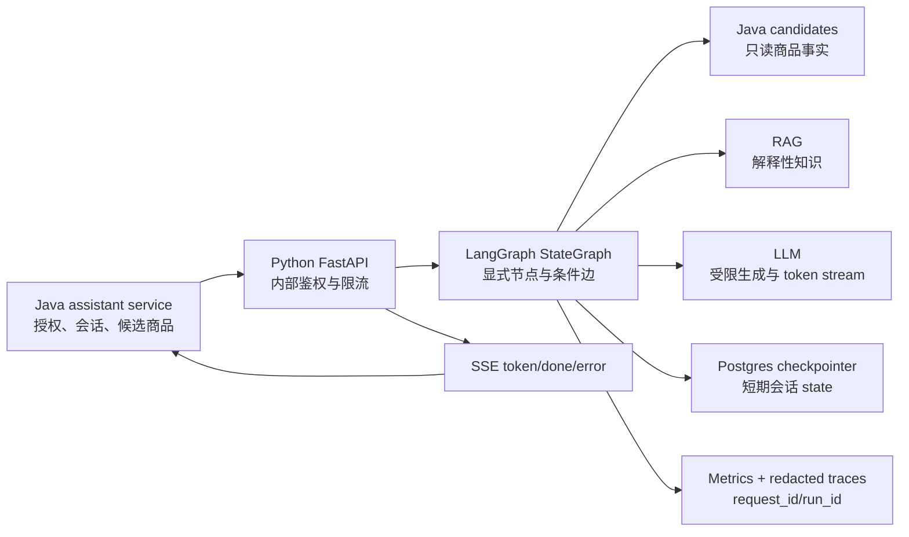

# LangGraph 生产就绪化设计

**状态：** 待用户确认，确认前不改运行时代码。  
**范围：** `AI-Clothing-Shopping-Assistant-System` 的 Python/FastAPI/LangGraph 服务。  
**目标：** 把当前“生产导向 MVP”升级为可小范围真实用户试用的单 Agent 服务：事实不越权、会话可恢复、流式真实可用、外部依赖可控、质量可量化、问题可追踪。

## 1. 当前基线与结论

当前主图已经具备正确的基础分层：

```text
intent_router
-> context_resolver
-> direct_answer_gate
-> missing_info_gate
-> structured_lookup / policy_fallback / rag_retriever
-> retrieval_grader
-> answer_generator
-> answer_validator
-> trace_logger
```

已具备的能力包括：

- 价格、库存与 SKU 不通过 RAG 生成；RAG 只提供解释性知识。
- 检索弱证据和空证据可以进入保守兜底。
- 答案中出现纯 RAG 无法证明的交易事实时会重试，重试次数有上限。
- Java/Python 请求、同步响应和 SSE 完成事件都有共享契约。
- 有路由、答案质量与真实检索三类测试/评测。

2026-07-12 本地基线：`python -m unittest discover -v` 通过 178 个测试。

因此，本次不是重写 LangGraph，也不引入多 Agent。当前差距主要在生产运行能力，而不是节点数量。

## 2. 目标状态和非目标

### 2.1 本期目标

1. **事实边界可强制执行**：生产 API 不使用本地演示商品目录回答价格、库存或商品可售事实。
2. **隐私与调试边界可审计**：默认日志不记录完整请求体、候选集、对话历史、用户画像或模型 prompt。
3. **流式体验真实**：客户端在模型回答生成期间收到 token；客户端断开后可停止下游生成。
4. **会话可恢复**：短期 Agent state 使用持久化 checkpointer，服务重启与多实例后不会因内存丢失而失效。
5. **依赖故障可预期**：模型和向量服务具备超时、有限重试、限流/并发保护和安全降级。
6. **质量持续可测**：离线评测、线上指标和用户反馈可以共同定位质量问题。

### 2.2 非目标

- 不引入多 Agent、自治工具调用、MQ、Kafka、向量数据库集群或模型微调。
- 不改变 Java 是用户、会话、商品、库存、价格、订单与支付事实源的边界。
- 不改变 `POST /chat`、`POST /chat/stream` 的既有 v1 字段含义；如必须新增字段，先升级共享契约并同步 Java。
- 不让 Python 直接写入 Java 商品或交易数据。

## 3. 设计原则

| 原则 | 本项目中的落地含义 |
| --- | --- |
| 单 Agent、显式图 | 保持现有 `StateGraph`；业务能力通过节点和条件边扩展，不用 prompt 隐藏流程。 |
| Java 事实源 | `candidates` 是生产请求唯一的商品事实输入；Python 只排序、解释并回传可追溯 `product_refs`。 |
| 保守失败 | 证据不足、依赖超时、候选缺失时，不猜价格/库存，不生成不可验证商品引用。 |
| 观测不泄密 | 指标与 trace 用 `request_id`、`run_id`、枚举原因和计数定位问题，不记录原始隐私负载。 |
| 先评测再调参 | RAG 阈值、路由规则与 prompt 变化必须有离线基线和回归结果。 |
| 逐步兼容 | 先保持现有对外契约和同步接口，再添加真实流式与内部能力。 |

## 4. 目标架构



### 4.1 运行时数据流

1. Java 完成鉴权、会话归属和候选商品筛选，调用 Python 并携带 `request_id`、`session_id`、`thread_id`、只读 `user_context` 与 `candidates`。
2. Python 验证请求、内部调用身份和请求大小；生成或继承 `run_id`。
3. LangGraph 运行现有节点。价格、库存和可售 SKU 只读取本轮 `candidates`；解释性问题才访问 RAG。
4. `answer_validator` 校验结构化事实、RAG 证据与候选可追溯性。失败进入明确的兜底节点。
5. LangGraph 持久化短期 state；Java 仍是对话消息与用户长期画像的主存储。
6. `/chat` 返回完整响应；`/chat/stream` 在模型生成时逐 token 转发，并以现有 `done` 事件收尾。
7. 仅写入脱敏 trace 和聚合指标；Java 的用户反馈与本次 `request_id`/`run_id` 关联，进入评测数据集而非只写日志。

## 5. 分阶段改进清单

### Phase 0：阻断事实越权与敏感日志（P0）

**目的：** 先消除会直接伤害真实用户和数据边界的风险。

| 工作项 | 现状位置 | 目标修改 | 验收标准 |
| --- | --- | --- | --- |
| 生产事实源隔离 | `clothing_assistant/agent/nodes.py` 的 `run_catalog_lookup` | 根据显式运行模式区分 `demo` 和 `production`。生产请求没有 `candidates` 时，价格/库存进入 `missing_authoritative_candidates` 兜底；本地 JSON 仅供 demo/测试依赖注入。 | 无 candidates 的生产库存/价格请求不返回本地商品、库存、价格或 `product_refs`。 |
| 调整数据边界文档 | `docs/data-boundary.md` | 说明本地 `product_catalog.json` 是 demo fixture，不是生产事实源。 | 文档与共享 `business-rules.md` 一致。 |
| 安全日志 | `clothing_assistant/api/app.py` 的 `validation_exception_handler` | 删除完整 `body` 和 `exc.errors()` 日志；只记录 `request_id`、HTTP 路径、脱敏字段路径和错误类型。 | 自动测试证明含用户画像/候选商品的非法请求不会出现在日志。 |
| 调试访问控制 | `clothing_assistant/api/app.py`、部署配置 | `debug=true` 只允许内部开发环境或 Java 传递的受信调用身份；生产默认强制隐藏。 | 非受信调用即使传 `debug=true` 也无法获得 trace/prompt/tool 原始结果。 |

**涉及文件：**

```text
clothing_assistant/agent/nodes.py
clothing_assistant/api/app.py
clothing_assistant/api/schemas.py
clothing_assistant/config_data.py
docs/data-boundary.md
tests/test_langgraph_production_nodes.py
tests/test_api.py
```

### Phase 1：会话持久化与请求治理（P1）

**目的：** 让服务重启、并发与多实例部署时的行为一致且可恢复。

| 工作项 | 现状位置 | 目标修改 | 验收标准 |
| --- | --- | --- | --- |
| 持久化 checkpointer | `clothing_assistant/agent/langgraph_executor.py` | 用 PostgreSQL checkpointer 替代 `InMemorySaver`；开发/测试仍可注入内存实现。 | 服务实例重建后，同一 `thread_id` 的短期 state 可读取；不同 thread 绝不串状态。 |
| state 生命周期 | `clothing_assistant/agent/state.py` | 标注跨轮字段和单轮字段；只允许短期上下文、流程状态和必要摘要持久化。 | 价格、候选、完整 prompt、完整历史不被错误跨轮复用。 |
| 请求预算 | FastAPI middleware/new module | 增加请求体大小、每会话并发、每用户或调用方限流、总工具/生成预算。 | 超限返回安全、稳定的错误码，且不会继续调用模型。 |
| 调用链身份 | Java/Python 部署配置 | Python 仅接受 Java 内网调用或服务间凭证；Python 不承担前端授权。 | 未提供受信身份的调用被拒绝；Java 端仍保留用户授权与候选筛选。 |

**说明：** PostgreSQL 选型仅用于 LangGraph 短期执行状态。用户会话消息、用户画像、商品事实与反馈事实仍由 Java/MySQL 所有。

### Phase 2：真实 SSE、模型韧性与取消（P1）

**目的：** 从“完整答案切块发送”升级为真实可中断的流式体验。

| 工作项 | 现状位置 | 目标修改 | 验收标准 |
| --- | --- | --- | --- |
| 真实 token stream | `clothing_assistant/api/app.py`、`api/streaming.py`、`application/answer_service.py` | 为生成节点增加流式执行路径；模型产生 token 时立即形成 v1 `token` 事件，不暴露内部图事件。 | 首个 token 在模型完成前产生；最终 `done.answer` 等于 token 拼接结果。 |
| 同步/流式共享校验 | `langgraph_executor.py`、`nodes.py` | 业务节点和 validator 共用；只有输出适配层不同，避免两条逻辑漂移。 | 同一输入的事实边界、`product_refs` 与 stop reason 一致。 |
| 断连取消 | FastAPI streaming generator | 检测 Java/客户端断连，取消未完成的模型流和后续工作。 | 断连后不继续产生 token、不消耗后续模型输出。 |
| 依赖策略 | `infrastructure/llm_client.py`、RAG client | 为 LLM/embedding 设置连接和读取超时、有限退避重试、可分类异常、并发上限；不可恢复时进入安全兜底。 | 模拟 429、超时、5xx 时无堆栈泄露、无无限重试、能记录原因指标。 |

**兼容约束：** 继续保留 v1 的 `token`、`done`、`error` 事件和单行 JSON `data`；不向 token 事件加入 trace、prompt、chunk 或密钥。

### Phase 3：质量闭环、观测和上线门槛（P2）

**目的：** 让“看上去回答不错”变成可持续验证的质量与可靠性标准。

| 工作项 | 现状位置 | 目标修改 | 验收标准 |
| --- | --- | --- | --- |
| 可观测指标 | `agent/tracing.py` 与新 metrics module | 记录请求数、成功率、首 token 耗时、总耗时、RAG 接受率、fallback 率、模型错误率、重试次数和 token/成本估算。 | 可按 intent、stop reason 和依赖错误类别查询，不携带原文用户消息。 |
| 结构化 trace | `trace_logger_node` | trace 通过 `request_id`/`run_id` 关联；生产存储有 TTL 与脱敏规则。 | 排障可还原节点路径和证据计数，但不暴露个人资料/完整候选集。 |
| 反馈闭环 | `/chat/feedback` | 使用共享标识关联 Java 已持久化的 message/feedback；Python 只消费匿名化评测样本或聚合结果，不把反馈只写日志。 | 点赞/点踩可关联一次回答、意图、fallback 和证据质量，进入待标注队列。 |
| 评测集扩展 | `agent/*eval*` | 增加真实匿名问题集，覆盖每类意图、模糊需求、候选为空、依赖失败、提示注入、隐私与 SSE 断连。 | CI 固定运行确定性集；发布前运行真实 RAG 回归并比较基线。 |
| 发布门槛 | CI/部署文档 | 增加 lint、类型/契约、单测、评测、依赖健康检查、部署回滚说明。 | 变更未通过关键边界测试或质量阈值不能发布。 |

## 6. LangGraph 图的演进边界

本期保持单图，不增加“万能 Agent executor”。目标图为：

```text
START
-> request_guard
-> intent_router
-> context_resolver
-> direct_answer_gate
-> missing_info_gate
-> structured_lookup
-> policy_fallback / rag_retriever / answer_generator
-> retrieval_grader
-> answer_generator / fallback_answer
-> answer_validator
-> answer_generator / fallback_answer
-> trace_logger
-> END
```

其中：

- `request_guard` 只执行输入大小、调用方身份、debug 权限和请求预算检查；不做业务理解。
- `structured_lookup` 在生产只消费 Java 候选商品，不再隐式读取 demo catalog。
- `rag_retriever`、`retrieval_grader`、`answer_validator` 保持确定性证据约束；LLM 不获得修改事实或工具路由的权限。
- `trace_logger` 写摘要和指标，不写用户原文、完整历史、完整 prompt 或原始候选集。
- 流式不是另一张业务图，而是图执行结果的输出通道；节点路由与校验规则必须一致。

## 7. 测试与验收策略

### 7.1 必须自动化的测试

| 类别 | 关键场景 |
| --- | --- |
| 边界测试 | 生产模式无 candidates 时不使用本地 catalog；所有 `product_refs` 可追溯到当前 candidates。 |
| 隐私测试 | 422、500、trace、SSE 不泄露完整请求体、画像、候选集、prompt、chunk 或凭证。 |
| 会话测试 | checkpointer 重启恢复、跨 thread 隔离、TTL 到期后安全降级。 |
| 韧性测试 | LLM/RAG 超时、429、5xx、断连取消、重试上限和 fallback。 |
| SSE 测试 | token 在 done 前、token 拼接等于 done answer、单行 JSON、断连不继续生成。 |
| 契约测试 | Python/Java v1 字段 manifest、同步 `/chat` 与流式 `done` 一致。 |
| 评测回归 | 路由、答案质量、真实检索、候选重排序与提示注入/越界问题。 |

### 7.2 初始上线指标与门槛

先建立基线，连续观察后再收紧目标。小范围试用的第一版建议门槛：

| 指标 | 初始门槛 |
| --- | ---: |
| P0 事实/隐私边界自动化测试 | 100% 通过 |
| Python 单元与共享契约测试 | 100% 通过 |
| 已标注正向 RAG Hit@3 | >= 90% |
| 已标注知识外问题正确拒答率 | >= 90% |
| 无证据却生成强交易事实 | 0 个已知回归 case |
| 运行时异常导致的原始堆栈/敏感负载对外泄露 | 0 |
| fallback 比率、首 token、总耗时 | 先记录基线，再按真实流量设 SLO |

## 8. 实施顺序

```text
Phase 0：事实源隔离 + 日志/调试权限
    ↓
Phase 1：Postgres checkpointer + 请求治理
    ↓
Phase 2：真实 SSE + 模型/RAG 韧性 + 断连取消
    ↓
Phase 3：指标、反馈闭环、评测扩大、CI/发布门槛
```

原因：Phase 0 先防止错误事实和泄密；Phase 1 才让状态可靠；Phase 2 在可靠状态与安全边界上实现真实体验；Phase 3 用指标和反馈决定后续优化，而非继续盲目增加 LangGraph 节点。

## 9. 需要在实施前确认的决策

1. Python 生产服务与 Java 的内部调用身份采用何种方式：内网网络策略、mTLS，还是短期服务 token。
2. 可复用的 PostgreSQL 是否由现有 Java 数据库提供独立 schema，还是单独的 AI state 数据库。
3. 真实流式是否由 Kimi/OpenAI 兼容接口提供稳定 token stream；若 provider 不支持，保留同步回答而不把切块伪装为真实流式。
4. 用户反馈的原始事件继续只由 Java 持久化；Python 接收的只应是关联 ID 和可用于评测的脱敏聚合数据。

这些决策不改变 Java/Python 职责边界，但会决定后续具体部署与配置方案。

## 10. 参考现有代码与合同

- LangGraph 图：`clothing_assistant/agent/langgraph_executor.py`
- 节点与路由：`clothing_assistant/agent/nodes.py`
- 状态契约：`clothing_assistant/agent/state.py`
- API 与 SSE：`clothing_assistant/api/app.py`、`clothing_assistant/api/streaming.py`
- 数据边界：`docs/data-boundary.md`
- 共享业务规则：`../outfit-project-contract/docs/business-rules.md`
- 共享流式合同：`../outfit-project-contract/contracts/assistant-streaming-chat/v1.md`
